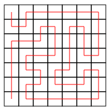

# 'Tis Diwali!

Your self driving car is really popping off, and people have started requesting trials. To ramp up the hype, you claim sold out bookings for the next 6 months, and now the hype train is loading up.  
So much so, on a lazy Sunday afternoon, you receive a most peculiar request. It's Santa Claus, and he seeks your help.  
Diwali is coming, and the festive season brings with it renewed plans and fresh perspectives. Santa is not untouched by the warmth of the festival of lights. He decides its time for him to do what he does best.

This Diwali, Santa wants to deliver gifts and sweets to children. He's all set for his noble endeavour, and seeks your help for the delivery. He poses the following problem.

## The Problem

There are 49 houses in a town, arranged in a square $7\times 7$ grid.
Santa wants to deliver presents to each of the houses, starting at the house in the top left, and ending at the bottom left.
He plans to visit a house exactly once. You're on vacation, but your team back at the headquarters lays down an optimal strategy, as a $48$ character string of characters `L`, `D`, `R`, `U`, (see that it takes 48 moves to go from top left to bottom left, visiting all houses) instructing the car to go Left, Down, Right, Up on the grid respectively, and transmits it to the car. For each move, the car will move in the direction specified by the character it reads. For example, the string `DRURRRRRDDDLUULDDDLDRRURDDLLLLLURULURRUULDLLDDDD` means the following path.  

    </img>

Unfortunately, because (the perhaps smug) you did not solve the Communication challenge, the message got corrupted and some of the characters got replaced with `?`. When the car reads a `?` instruction, it can move in any direction. Can you find the number of ways the car can complete its journey?

## Example

Your program will take as input a $48$-character string, and output the number of possible paths that match the string description, with `?` menaing any direction.

**Input**:  
??????R??????U??????????????????????????LD????D?  
**Output**:  
201
**Input**:  
??????R??????U????????????????R??D?????L????????
**Output**:  
65

## Optimisation

An ordinary backtracking based approach would give the answer, but we can optimise our search for paths by pruning known-to-fail branches of the case tree. If we know certain configurations will never be able to visit all houses, we can stop looking into further cases based off of that configuration.

If the car is at a house on the right edge, say, and both the houses above and below it are unvisited, then it is impossible to visit both of them without visiting an already visited house in the process. Can you see why? What other cases like this result in a failed path and can be used to stop the search when identified?
