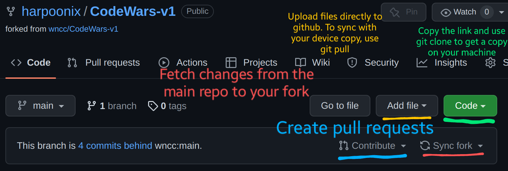

# Gr-Affable | Hello FOSS 2022

Welcome to **Gr-Affable**, a project on DSA and Graph Theory under **Hello FOSS 2022** !

Here, We explore algorithms with special emphasis on Graph Theory.

Many programming problems can be solved by modeling them as a Graph problem and using appropriate graph algorithm. There are many clever and efficient graph algorithms that can resolve difficult problems effectively. We will get to know about these Algorithms while solving the problems here.

We embark upon a rather ambitious journey - to design algorithms for a self-driving car! How does your car move when given the map of a city? What routes does it take? Code your way out of the traffic on the city streets!

## Guidelines

- Take any input/output format you see fit, if the problem doesn't mentions it. This is not an autograded lab ;)  
- Explore various problems that are provided here, think on there implementation. Try to solve them first. If you can think of a better solution, do implement it. We have provided some hints and ideas to start with
- Some of the problems have a code for it. Try to see if that code works. If not, do contribute to that code and make it more efficient.
Begin your journey -

1. [Sorting and Searching](./Sorting%20and%20Searching/)
2. [Symphony](./Symphony/) (Algorithmic Time Complexity)
3. [Grid Ways](./Grid_Ways/) (Basic Dynamic Programming)
4. [Dijkstra](./Dijkstra/)
5. [Bellman Ford](./Bellman-Ford/)
6. [Maze](./Maze/) (Application of BFS)
7. [Surplus](./Surplus/) (Tree Algorithms)
8. [Closest Points](./Closest-Points/) (Divide and Conquer)
9. [Check Paths](./Check%20Paths/) (Directed Graphs)
10. [Communication](./Communication/) (Huffman Coding and RSA Encryption)
11. [Diwali](./Diwali/) (Optimised Backtracking)
12. [Strongly Connected](./Strongly%20Connected/)

The order is in no way strict. If you feel puzzled by a problem, feel free to approach the next one, or have a look at the other problems.

### Clone, Commit and Push

After you have forked this repo, go to your fork, and click on the Code drop down button. Copy the link of your fork, which would look like `https://github.com/username/Gr-affable.git`. Make a new folder on your device, open a powershell terminal in that folder or right click and select `Git bash here`. Then run `git clone https://github.com/username/Gr-affable.git`.

This will make a copy of your fork on your device, and now you can start coding files in the IDE of your choice. A few handy commands - 

1. `git add filename` will add the file to the staging area, which means the file is now being tracked by version control. Do this before commiting the file.
2. `git commit` will commit your changes (adding a new file, commiting modified files etc.) to your local repository.
3. `git push` To push local committed changes on your device to the forked repository hosted on github.
4. `git pull` To get the changes made in your fork synced with the copy on your device. For example, if you make some changes to your fork (adding new files, modifying files) directly github.com, then you can get those changes to apply to the repo on your device.

A simpler way to add new files to your fork is by navigating to the desired folder and using the Add files button, then upload any files you want. To get the changes on your local device, run `git pull`.

### Sync your fork and create pull requests

Whenever there are some changes in the central repo (`harpoonix/Gr-affable`), they DO NOT apply directly to your fork. To get the changes from the *upstream* repository (`harpoonix/Gr-affable`) into your fork, simply click Sync Fork and Update branch. Now you've got the updates from the main repo into your own.

Once you've created some files and want to contribute, you can use the Contribute option to create a pull request.

Here is an example image that demonstrates some of these.

## Files to commit

If you have solved a particular question and want to contribute your work, make a file called `username_question.cpp` or something like that.
Say you want to add your attempt to the SPFA algorithm implementation, or the naive Bellman Ford implementation. Maybe you have solved the question `Bellman-Ford/Tunnels`.

In the folder, add a file called `username_tunnel.cpp`, or `username_spfa.cpp` or something like that. This allows us to accept submissions of multiple people, while keeping the challenge open for others.

***

Created with :heart: by <a href="https://wncc-iitb.org/">WnCC</a>

