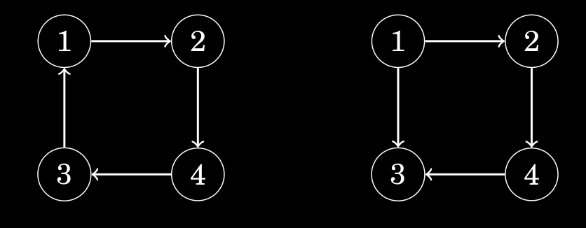

# Strongly Connected

In a directed graph, the edges can be traversed in one direction only, so even if
the graph is connected, this does not guarantee that there would be a path from
a node to another node.  
A graph is said to be **Strongly Connected** if there is a path from any node to **all** other nodes in the graph.
For example, consider a directed graph, which can be traversed only in a single direction. Therefore, it may or may not always be possible to reach every other node from a particular node.

</img>

The above is a Linear Graph which is not Strongly Connected. (Can't reach $A$ from $B$)

Below, The Graph on the right is **NOT** Strongly Connected, but the one on the **left is.**

</img>

## Strongly Connected Components

Subsets of nodes in a directed graph where each node is connected to other node in the subset are strongly connected components.

## Problem Statement

You are given an undirected graph. You have to check whether this can be converted into a Strongly Connected directed graph. If yes, then assign a direction to each edge of the graph so that the resulting directed graph produced is Strongly connected. If No, simply print ``NOT POSSIBLE``.

### Input

- first line : two integers representing the number of nodes and edges. For simplicity, the nodes are numbered from 1 to $n$
- next $m$ lines : two integers representing that there exists an edge between these two nodes

### Output

- Print $m$ lines with each line having two integers representing a directed edge from first integer's node to second
- If no such strongly connected graph exists, then print ``NOT POSSIBLE``

## Hints

Notice that there exist two cases in which making a strongly connected graph won't be possible -

1. The given graph is not a single connected component itself
2. If the graph has a bridge in it

Well, the first case can be handled by DFS. For second case, checking of Bridges is to be done in the graph.
If any of the above cases is observed, then you can easily get that the solution is not possible. Else if the soluion is possible, then constructing the desired graph can be achieved by assigning each edge the direction in which it was traversed by DFS initially.

### Finding Bridges

- Naive approach : A simple idea to find bridges would be to delete every edge one by one and check every time whether the resulting graph is connected. You have to check the connectednes of resulting graphs using BFS/DFS for each edge. So, the time complexity would be O(E*(V+E)). Do not forget to add the removed edge back again into the original graph.
- A Better Idea : After DFS traversal, an edge $(x,y)$ (such that x is parent of y) in DFS tree would be a bridge if there is no path to reach $x$ or any ancestor of $x$ from subtree rooted at y other than the edge $(y,x)$ itself. The algorithm is based on [Tarjan's Algorithm](https://www.geeksforgeeks.org/tarjan-algorithm-find-strongly-connected-components/), which is a efficient way to find bridges and Articulation points in linear time.

## Instructions
Upload your code as ``<your_GitHub_username>_stronglyConnected.cpp``. You may upload different versions of your code according to the algorithm that you are using if you wish. Just add version number at the end of the code you upload.
